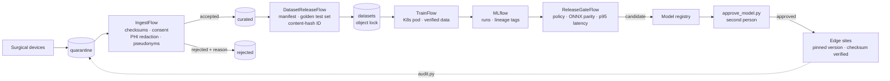

# Surgical Segmentation MLOps — Proof of Concept

A local-scale, working version of a **regulated ML platform** for surgical
image segmentation. Device uploads are quarantined, checked and de-identified,
frozen into immutable datasets, used to train a model in Kubernetes, gated
against a written release policy, approved by a second person, and deployed to
edge servers that refuse anything unapproved. One command traces any deployed
model back to the original device uploads.

Built with **Kubernetes (Minikube) · MinIO · Metaflow · Argo Workflows · MLflow · ONNX Runtime**,
on real laparoscopic surgery data ([CholecSeg8k](docs/dataset.md)).



## What it demonstrates

| Requirement | How it's met |
|---|---|
| Large, growing datasets | Device uploads land in quarantine; an hourly Argo job ingests them |
| Strict versioning | Datasets are content-addressed: the dataset ID is a hash of every file, split and label source |
| Immutability for audits | MinIO object lock (WORM) on dataset files, manifests and every release decision |
| Lineage | Every model links to dataset ID, git commit, runtime image and Metaflow run; `audit.py` verifies each link |
| PHI handling | Burned-in patient text redacted, identifiers replaced by keyed pseudonyms; no PHI past quarantine |
| No data leakage | Train/test split by surgical case; frozen golden test set; patient-overlap check |
| Release control | Written, versioned release policy (per-class IoU, regression, ONNX parity, latency) |
| Separation of duties | The trainer can't approve their own model; decisions are write-once records |
| Edge deployment with SLAs | ONNX Runtime servers, p95 latency gated at 33 ms; pinned versions; safe rollouts and rollback |
| Monthly retraining | Argo cron workflows: dataset release → training → gate; approval stays manual |
| Continuous testing | GitHub Actions runs unit tests on the safety-critical rules on every push |

## Results

- Model: LR-ASPP MobileNetV3, trained on CPU in a Kubernetes pod (4 epochs, 2,320 frames)
- Test (golden cases, never seen in training): **mean IoU 0.429**, pixel accuracy 0.857
- Strong on liver (0.78), abdominal wall (0.80), background (0.96); **cystic duct 0.00**.
  High pixel accuracy hides a safety-critical miss, which is why the gate checks
  per-class IoU and the v1 intended use excludes the cystic duct.
- Edge: ONNX p95 latency 14 ms in the gate; ~18–21 ms per request on the edge servers
- Audit: `CHAIN INTACT` from the Boston device back to 35 device uploads

## Repository layout

```
flows/                 Metaflow pipelines
  ingest_flow.py         quarantine -> curated / rejected
  dataset_release_flow.py curated -> locked, content-addressed dataset
  train_flow.py          dataset -> trained model in MLflow
  release_gate_flow.py   model -> registry candidate (or rejection)
  surgseg/               shared code: lake, ingest, datasets, labels, train, gate
scripts/
  env.sh                 set up a terminal tab
  port_forwards.sh       tunnels to MLflow, data lake, edge sites
  simulate_device_upload.py
  approve_model.py       human approval (separation of duties)
  edge_predict.py        send a frame to an edge site, save the overlay
  audit.py               trace a deployed model back to device uploads
  deploy_schedules.sh    deploy the flows to Argo as cron workflows
  build_and_load.sh      build an image and load it into Minikube
docker/                minio · mlflow · runtime · train · gate · edge images
k8s/                   MLflow, data lake, bucket setup, edge sites
tests/                 unit tests (run in GitHub Actions)
docs/                  dataset, known issues, demo script
```

## Running it

Requires macOS or Linux, Docker with ~6 CPUs / 12 GB RAM, Python 3.11.

```bash
python3.11 -m venv .venv && source .venv/bin/activate
pip install -r requirements.txt

# Tab 1 — the platform (leave running)
MINIKUBE_CPUS=5 MINIKUBE_MEMORY=10240 SERVICES_OVERRIDE=minio,metadata-service,ui,argo-workflows metaflow-dev up

# One-time setup: images, data lake, MLflow, dataset
scripts/build_and_load.sh mlflow-server:3.16.1 docker/mlflow   # likewise runtime, train, gate, edge
kubectl apply -f k8s/datalake.yaml -f k8s/datalake-buckets-job.yaml -f k8s/mlflow.yaml

# Tab 2 — tunnels (leave running)
scripts/port_forwards.sh

# Tab 3 — work
source scripts/env.sh
python scripts/simulate_device_upload.py --video video01 --clips 2
python flows/ingest_flow.py run --max-workers 4
python flows/dataset_release_flow.py run --max-workers 4
python flows/train_flow.py run
python flows/release_gate_flow.py run
python scripts/approve_model.py --version <v> --approver qa.reviewer --reason "..."
kubectl apply -f k8s/edge-sites.yaml
python scripts/edge_predict.py --site boston
python scripts/audit.py --site boston
```

MinIO's community images are no longer published, so `docker/minio` builds it
from pinned source; see [known issues](docs/known-issues.md) for this and other
real problems hit while building.

## Proof of concept vs. production

| Here | In production |
|---|---|
| Minikube on a laptop | On-prem Kubernetes (L40S/A6000 pools) + SLURM (B200) + cloud burst |
| CPU training, small model, 160×288 frames | Multi-node GPU training at full resolution |
| ~3 GB, 35 clips | Multi-TB video, sharded (e.g. WebDataset) and cached near GPUs |
| Object lock in GOVERNANCE mode, 30 days | COMPLIANCE mode, retained for the device's lifetime |
| Fixed-region redaction | Detection-based (OCR) redaction plus human QA sampling |
| Typed-in approver name | SSO identity; registry permissions enforce who can approve |
| Pseudonym key = data lake secret | Dedicated key in a KMS |
| Staggered cron schedules | Event triggers (`@trigger_on_finish` with Argo Events) |
| ONNX Runtime server | TensorRT + Triton on the robot's edge computer |
| One MinIO for everything | Separate accounts/buckets per role, replicated storage |

## Data

CholecSeg8k, CC BY-NC-SA 4.0. Downloaded locally, never committed.
See [docs/dataset.md](docs/dataset.md).